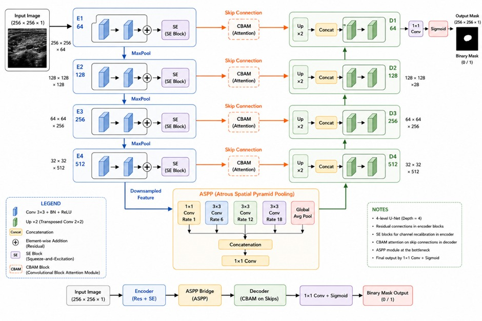
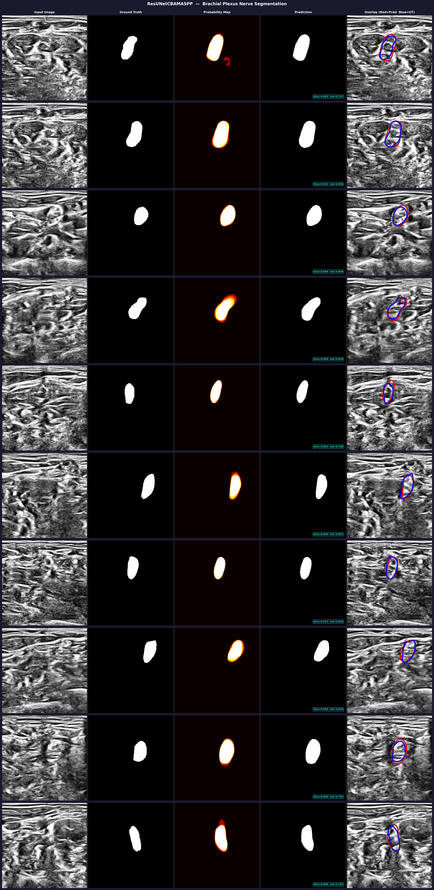
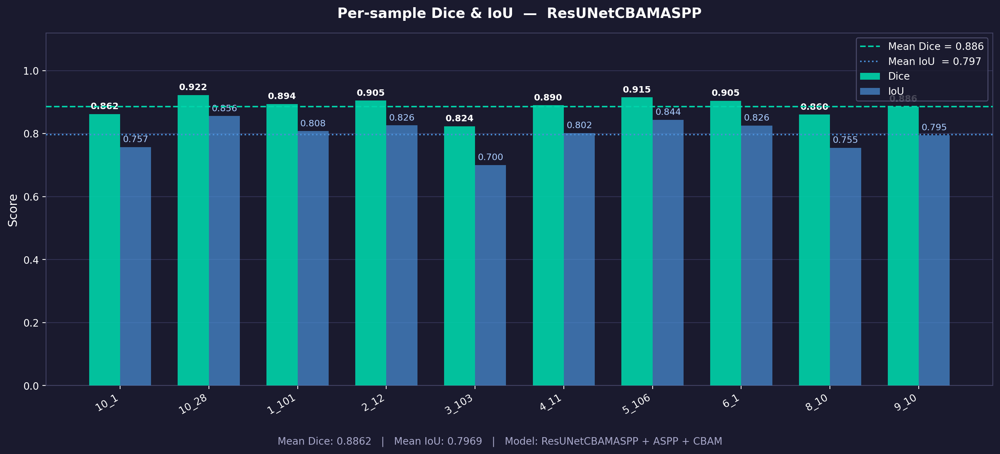
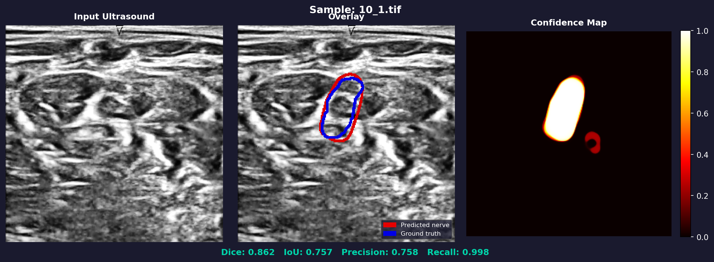
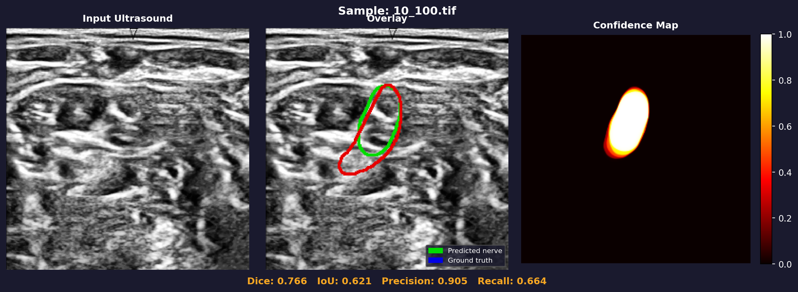
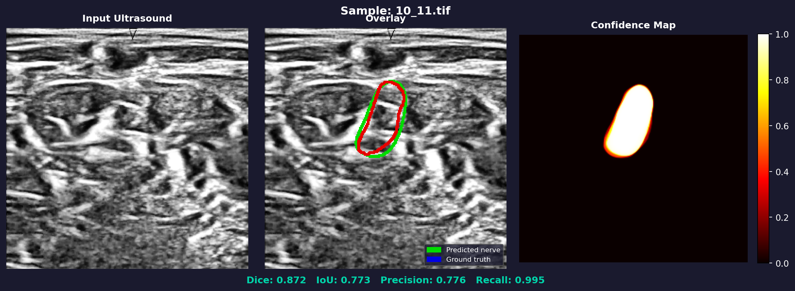
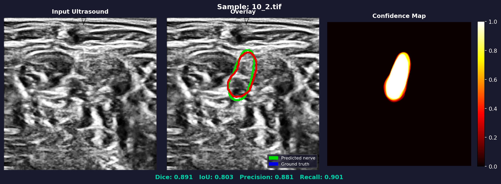
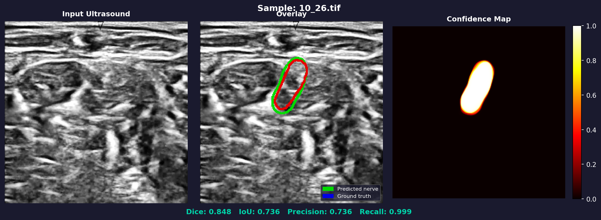
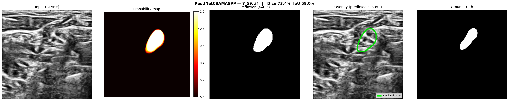

# Ultrasound Nerve Segmentation

A PyTorch deep-learning project that detects and segments nerves in ultrasound
images, served through a Flask web app for interactive inference.



## Architecture: ResUNetCBAMASPP

| Component | Details |
|-----------|---------|
| Encoder | 4× Residual blocks with Squeeze-and-Excitation (64→128→256→512 channels) |
| Bridge | Atrous Spatial Pyramid Pooling (ASPP) for multi-scale context |
| Skip gates | CBAM (Channel + Spatial attention) on every skip connection |
| Decoder | 4× Residual blocks + bilinear upsampling |
| Supervision | Deep auxiliary outputs at dec1/dec2/dec3 (training only) |
| Training | AdamW + OneCycleLR + AMP + gradient clipping |
| Augmentation | albumentations — elastic, grid distortion, noise, brightness, flips |
| Inference | 4-fold test-time augmentation (TTA) |

## Project Structure

```
nerve-segmentation/
├── README.md
├── requirements.txt
├── .gitignore
├── src/
│   └── train_best.py          # ResUNetCBAMASPP model + training
├── web_app/
│   ├── app.py                 # Flask inference server
│   └── templates/
│       └── index.html         # Web UI
├── models/
│   └── best_model_v2.pth      # trained weights (not committed — see below)
└── docs/
    ├── architecture.jpeg      # model architecture diagram
    └── outputs/               # sample prediction results
```

## Setup

```bash
# Create and activate a virtual environment
python -m venv venv
source venv/bin/activate        # Linux / macOS
venv\Scripts\activate           # Windows

# Install dependencies
pip install -r requirements.txt

# For GPU support (CUDA 11.8 example)
pip install torch torchvision --index-url https://download.pytorch.org/whl/cu118
```

## Dataset

Download the [Ultrasound Nerve Segmentation dataset](https://www.kaggle.com/c/ultrasound-nerve-segmentation/data)
from Kaggle and place it alongside this project:

```
ultrasound-nerve-segmentation/
├── train/      # paired *.tif images + *_mask.tif files
└── test/
```

## Training

```bash
python src/train_best.py
# Outputs: best_model_v2.pth (saved when validation loss improves)
```

## Web App

```bash
# Put the trained weights at models/best_model_v2.pth, then:
python web_app/app.py

# Open http://127.0.0.1:5000
```

Upload any ultrasound image (JPEG/PNG/TIFF/BMP). Optionally upload a
ground-truth mask to see Dice, IoU, Precision, and Recall metrics.

## Model Weights

The trained weights (`models/best_model_v2.pth`, ~45 MB) are included in this
repository, so the web app runs out-of-the-box after cloning. To retrain from
scratch, run `src/train_best.py` and replace the file.

## Results

| Metric | Value |
|--------|-------|
| Dice | ~0.73 |
| IoU | ~0.58 |

Sample outputs:




| | | |
|---|---|---|
|  |  |  |
|  |  |  |

## License

MIT
